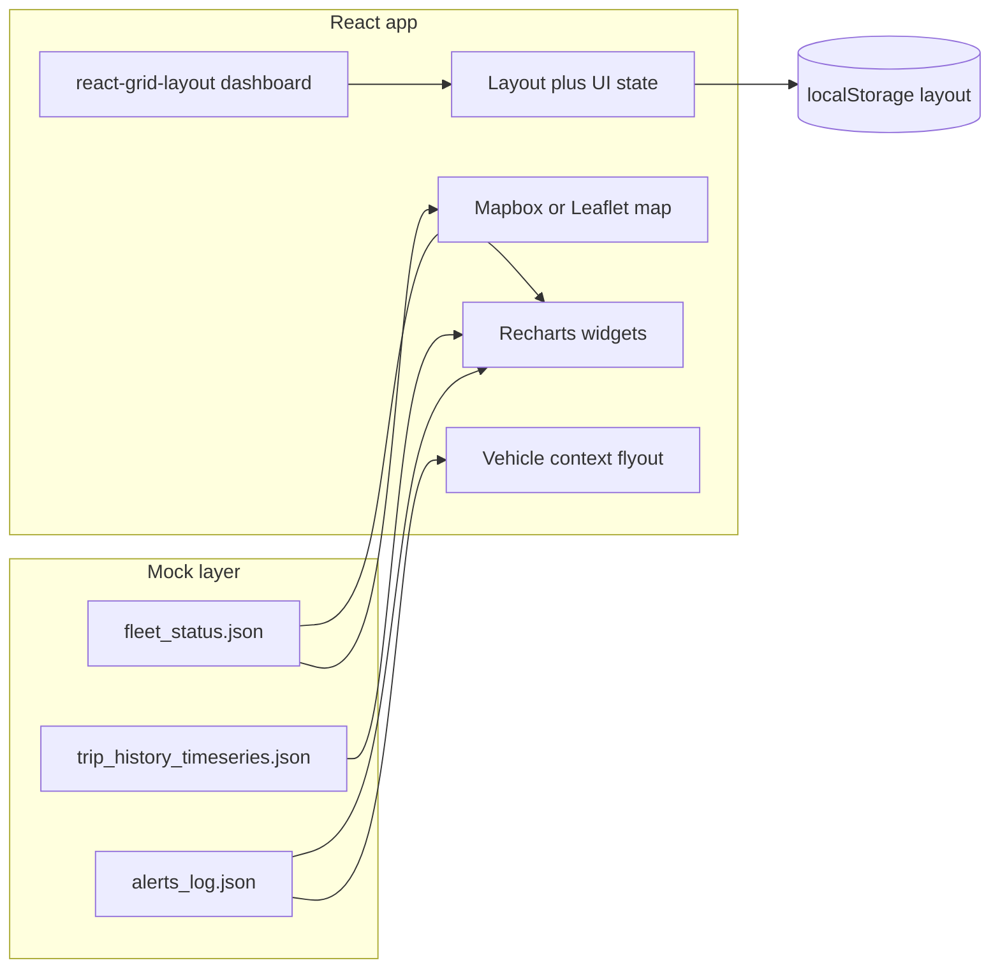

# Fleet Management Frontend POC — Implementation Plan

## How the sources fit together

| Source | Role in this plan |
|--------|-------------------|
| [Meeting notes (May 1, 2026)](https://docs.google.com/document/d/1rA3ao443uGSz3Pw7OkUDi9gkr5d0NJagCR6hYAI4nRk/edit) | **Product intent:** frontend-only UX on top of an existing platform (Violon/VLAN APIs), not a greenfield backend; emphasis on **reducing navigation depth**, **user-configurable views**, **map + hover** for compliance-style fields (working/resting time, fuel, satellite), and **dark mode** as a UX expectation. Follow-on work: API review, hosting/performance session, scoping and pricing. |
| [frontend-poc-spec.md](d:\jaxiCloud\frontend-poc-spec.md) | **Engineering contract for the POC:** React, draggable grid, local JSON/CSV mocks, Recharts (or Chart.js), Mapbox or Leaflet, `localStorage` layout persistence, specific widget set and three mock files. |

**Bridge statement:** The POC is a **visual and interaction prototype** of the meeting vision. Mock JSON stands in for Violon-shaped entities (`vehicle_id`, time series, alerts) so stakeholders can validate layout, density, and flows before investing in API integration.

## Current codebase baseline

- [package.json](d:\jaxiCloud\package.json): **Vite 8 + React 19**, TypeScript, ESLint — no Tailwind, Redux, charts, or map libs yet.
- Implementation will grow **inside this repo** (add dependencies and `src/` structure); no backend in scope for the POC.

## Target architecture (conceptual)

**Later (out of POC scope but designed for):** a thin **data provider** interface (`getFleetStatus()`, `getTripSeries()`, `getAlerts()`) implemented today by JSON imports; tomorrow by REST calls to Violon/VLAN. That keeps components dumb and swap-friendly.

## Phased delivery

### Phase 1 — Foundation and theming

- Add **Tailwind CSS** (per PRD) and a **dark/light toggle** persisted in `localStorage` (class strategy on `document.documentElement` is standard).
- Choose **Redux Toolkit** *or* **React Context** for: layout edit mode, selected vehicle for flyout, theme. RTK is preferable if the grid + flyout + filters grow; Context is enough for a strict POC — pick one and avoid both unless needed.
- Define **TypeScript types** for the three mock schemas (mirroring PRD fields) in e.g. `src/types/fleet.ts`.

### Phase 2 — Mock data and validation

- Add **`public/mock/`** (or `src/data/`) with:
  - `fleet_status.json` — enough rows (PRD says **50+** varied lines) for a credible map and gauge.
  - `trip_history_timeseries.json` — fluctuating series for line/bar charts (CO2, mileage, idle time, etc.).
  - `alerts_log.json` — severities and messages for table + flyout.
- Optionally generate CSV variants and parse with **PapaParse** only if you want to prove bulk-import-style pipelines; **JSON-first** keeps the POC simpler.
- Optional: **Zod** schemas to validate mock payloads at dev time (repo already pulls `zod` transitively via tooling — only add if you want runtime parse guards).

### Phase 3 — Customizable dashboard shell

- Integrate **react-grid-layout** with an **Edit mode** toggle (PRD §5.1): when on, drag/resize/remove; when off, static dashboard for demos.
- Persist layout as JSON in **`localStorage`** (widget id, x, y, w, h). Version the stored key (e.g. `jaxicloud.dashboard.v1`) so you can migrate layouts later.
- **Widget palette** (drawer/modal): register widget types — Gauge, Bar, Line, **Alerts table**, and **Map** (PRD treats map as a first-class tile; meeting emphasized map + list together).

### Phase 4 — Widgets (charts + table)

Per [frontend-poc-spec.md](d:\jaxiCloud\frontend-poc-spec.md):

- **Gauge:** average fleet fuel from `fleet_status.json`.
- **Bar:** weekly CO2 vs target — derive weekly buckets from `trip_history_timeseries.json` and a simple target constant or field in mock metadata.
- **Line:** fleet utilization / active vehicles over **last 30 days** from time series.
- **Table:** alerts from `alerts_log.json` (sortable by severity/time).

Use **Recharts** (good React fit) unless you have a strong preference for Chart.js.

### Phase 5 — Map and geofence

- **Leaflet + react-leaflet** avoids a paid token for demos; **Mapbox GL** if you need pitch/brand parity with commercial demos — requires **`VITE_MAPBOX_TOKEN`** in `.env` and clear README instructions.
- Plot markers from `fleet_status.json` (`current_lat` / `current_lng`).
- Draw a **static polygon** geofence (hardcoded coords in mock config).
- **Hover tooltip:** working/resting time, fuel %, satellite status — map PRD fields to mock (add `satellite_status` or similar to JSON if not already present).
- **Click marker or row** opens the flyout (same `vehicle_id`).

### Phase 6 — “One-click” vehicle context flyout

- **Meeting alignment:** This is the centerpiece for “fewer clicks” — aggregate **per `vehicle_id`**: status, driver, fuel, hours driven today, relevant alerts, and a **small sparkline or stat** from trip series for “recent trip stats.”
- Implement as a **side panel** (preferred for dashboard context) or modal; **no route change**.
- Wire selection from: map marker, alerts table row, optional compact vehicle list widget.

### Phase 7 — Hardening for stakeholder demos

- Loading/empty states for each widget.
- README: how to run, env vars for Mapbox (if used), and **explicit statement** that data is mock-only.
- **Out of scope for POC** (from meeting, defer): PDF/Excel export, real auth/RBAC, live API, hosting — list these as **phase 2 product** so expectations match the [documented next steps](https://docs.google.com/document/d/1rA3ao443uGSz3Pw7OkUDi9gkr5d0NJagCR6hYAI4nRk/edit) (API review, technical session).

## Key dependencies to add (when implementing)

- `tailwindcss`, `postcss`, `autoprefixer`
- `@reduxjs/toolkit` + `react-redux` *or* React Context only
- `react-grid-layout` (+ types if needed)
- `recharts`
- `leaflet`, `react-leaflet` *or* `mapbox-gl` + `react-map-gl`
- `papaparse` (optional)

## Risks and decisions

- **Map provider:** Leaflet = zero token; Mapbox = better visual polish, needs token.
- **Redux vs Context:** choose based on team comfort; RTK scales if the POC expands into filters and multiple pages.
- **Meeting vs PRD:** PRD is strict **no backend**; the meeting assumes **future** Violon APIs — keep a **data provider seam** so the POC does not paint you into a corner.

## Success criteria (demo-ready)

- User can **add/remove** widgets, **drag/resize** in edit mode, **refresh** and see layout **persist**.
- **Gauge / bar / line / alerts table** render from mocks with visually varied data.
- **Map** shows vehicles + geofence; **hover** and **click** behave as specified.
- **Vehicle flyout** shows consolidated mock data for one vehicle **without navigation**.
- **Dark mode** works across charts, map, and shell.
